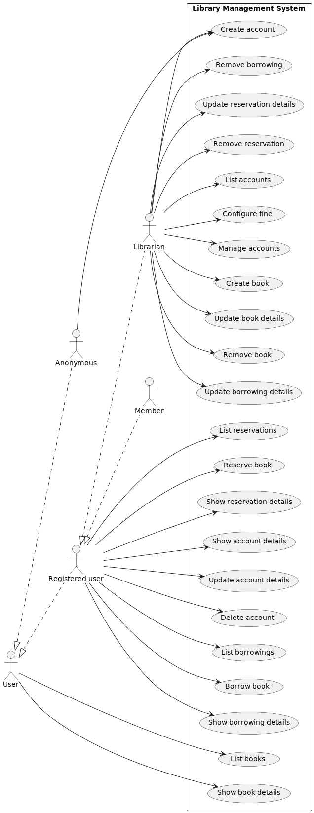
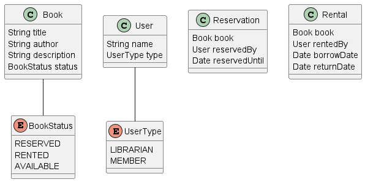

# Library Management System

## Project description

The Library Management System is a platform for managing library resources and services. When the users are too busy,
they do not have to come to the library and search for their favorite book. They can access the library's resources
online, search for books, reserve books, borrow and return books. The customers can search and list the books online
even without creating an account. When they create an account they become the members and may reserve, borrow and return
books. The system also provides a librarian role. The librarians are primarily responsible for managing the library
resources, adding new book and updating book information. Secondarily, they can manage user accounts and help them with
searching, reserving, borrowing, or returning the books. Each borrow has a price and a limit in days for returning. If
this limit is not kept, there is a fine set during the borrowing process for each delayed day.

## Microservices

To run the microservices, you first need to install dependencies:
```mvn clean install```

Then you can either run each microservice as standalone executable module from inside their respective path
directories: ```mvn spring-boot:run```
or
Run all microservices at once via containerization: ```podman-compose up -d``` / ```docker-compose up -d```

### Borrowing Microservice

#### Overview

Facilitates operations related to book borrowings. It provides functionalities for creating, updating, retrieving, and
deleting borrowings. This microservice manages information about book borrowings, including details such as the book
title,
the person borrowing the book, dates of borrowing and expected return, and any associated fines.

It's accessible at [http://localhost:8080](http://localhost:8080). Also, via GUI
on [http://localhost:8080/swagger-ui/index.html#](http://localhost:8080/swagger-ui/index.html#).

#### Endpoints

- **GET /api/borrowings:** Retrieve all borrowings.
- **POST /api/borrowings:** Create a new borrowing.
- **GET /api/borrowings/{id}:** Retrieve a borrowing by its ID.
- **PATCH /api/borrowings/{id}:** Update an existing borrowing.
- **DELETE /api/borrowings/{id}:** Delete a borrowing by its ID.
- **GET /api/borrowings/{id}/fine:** Retrieve the fine associated with a borrowing by its ID.

#### Implementation details

BorrowingDTO class is generated via OpenAPI. Refer to [OpenAPI documentation](https://swagger.io/specification/) and
borrowing's respective [openapi config file](/borrowing/src/main/resources/openapi.yaml).

### Reservation Microservice

#### Overview

The Reservation microservice allows users to create reservations on available books. It's accessible
at [http://localhost:8081](http://localhost:8081). Also, via GUI
on [http://localhost:8081/swagger-ui/index.html#](http://localhost:8081/swagger-ui/index.html#).

#### Endpoints

- **GET /api/reservations:** Retrieve all reservations.
- **POST /api/reservations:** Create a new reservation.
- **GET /api/reservations/{id}:** Retrieve a reservation by its ID.
- **PATCH /api/reservations/{id}:** Update an existing reservation.
- **DELETE /api/reservations/{id}:** Delete a reservation by its ID.
- **GET /api/reservations/active:** Retrieve all active reservations.
- **GET /api/reservations/expired:** Retrieve all expired reservations.

#### Implementation details

ReservationDTO class is generated via OpenAPI. Refer to [OpenAPI documentation](https://swagger.io/specification/) and
reservation's respective [openapi config file](/reservation/src/main/resources/openapi.yaml).

### User Microservice

#### Overview

The User microservice allows users to create, manage, and delete (own) accounts. Librarians can list and manage all
users. It's accessible at [http://localhost:8082](http://localhost:8082). Also, via GUI
on [http://localhost:8082/swagger-ui/index.html#](http://localhost:8082/swagger-ui/index.html#).

#### Endpoints

- **GET /api/users:** Retrieve all users.
- **POST /api/users:** Create a new user.
- **GET /api/users/{id}:** Retrieve a user by its ID.
- **PATCH /api/users/{id}:** Update an existing user.
- **DELETE /api/users/{id}:** Delete a user by its ID.
- **GET /api/users/adults:** Retrieve all adults.

#### Implementation details

UserDTO class is generated via OpenAPI. Refer to [OpenAPI documentation](https://swagger.io/specification/) and users's
respective [openapi config file](/user/src/main/resources/openapi.yaml).

### Book Microservice

#### Overview

The Book microservice allows users to retrieve, create, delete, and update books. It also provides some additional
functionality, such as enumerating borrowings of a specific book. It's accessible
at [http://localhost:8083](http://localhost:8083). Also, via GUI
on [http://localhost:8083/swagger-ui/index.html#](http://localhost:8083/swagger-ui/index.html#).

#### Endpoints

- **GET /api/books:** Retrieves all books that match the provided filter.
- **POST /api/books:** Creates a new book.
- **GET /api/books/{id}:** Retrieves a book by its ID.
- **PATCH /api/books/{id}:** Updates an existing book.
- **DELETE /api/books/{id}:** Deletes a book by its ID.
- **GET /api/books/{id}/borrowings:** Retrieves all borrowings of a specific book.

#### Implementation details

BookDTO class is generated via OpenAPI. Refer to [OpenAPI documentation](https://swagger.io/specification/) and
book's respective [openapi config file](/book/src/main/resources/openapi.yaml).

## Diagrams

- **Use Case Diagram:** Illustrates the various interactions between users and the system.
- **Class Diagram for the DTOs:** Defines the data transfer objects used within the system.

For more details on the Library Management System and its microservices, refer to the project documentation.

### Use Case Diagram



### Class Diagram for the DTOs


****
