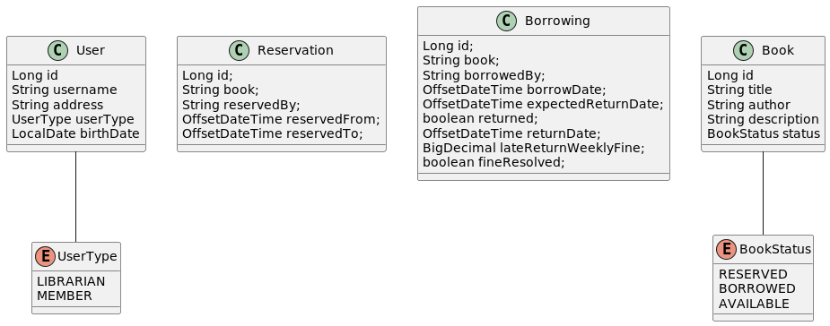

# Library Management System

## Project description

The Library Management System is a platform for managing library resources and services.
When the users are too busy, they do not have to come to the library and search for their favourite book.
They can access the library's resources online, search for books, reserve books, borrow and return books.
The customers can search and list the books online even without creating an account.
When they create an account they become the members and may reserve, borrow and return books.
The system also provide a librarian role.
The librarians are primarily responsible for managing the library resources, adding new book and updating book
information.
Secondarily, they can manage user accounts and help them with searching, reserving, borrowing or returning the books.
Each borrow has a price and a limit in days for returning.
If this limit is not kept, there is a fine set during the borrowing process for each delayed day.

## Microservices

To run the microservices, you first need to install dependencies:
```mvn clean install```

Each microservice is a standalone executable module and can be run from inside their respective
directories: ```mvn spring-boot:run```

### Reservation Microservice

#### Overview

The Reservation microservice allows users to create reservations on available books.
It's accessible at http://localhost:8084. Also, via GUI on http://localhost:8084/swagger-ui/index.html#/.

#### Endpoints

- **GET /api/reservations:** Retrieve all reservations.
- **POST /api/reservations:** Create a new reservation.
- **GET /api/reservations/{id}:** Retrieve a reservation by its ID.
- **PATCH /api/reservations/{id}:** Update an existing reservation.
- **DELETE /api/reservations/{id}:** Delete a reservation by its ID.
- **GET /api/reservations/active:** Retrieve all active reservations.
- **GET /api/reservations/expired:** Retrieve all expired reservations.

## Diagrams

- **Use Case Diagram:** Illustrates the various interactions between users and the system.
- **Class Diagram for the DTOs:** Defines the data transfer objects used within the system.

For more details on the Library Management System and its microservices, refer to the project documentation.

### Account

tbd

### Book

tbd

### Catalogue

tbd

### Fine

tbd

### Rental

tbd

## Use Case Diagram


## Class Diagram for the DTOs




